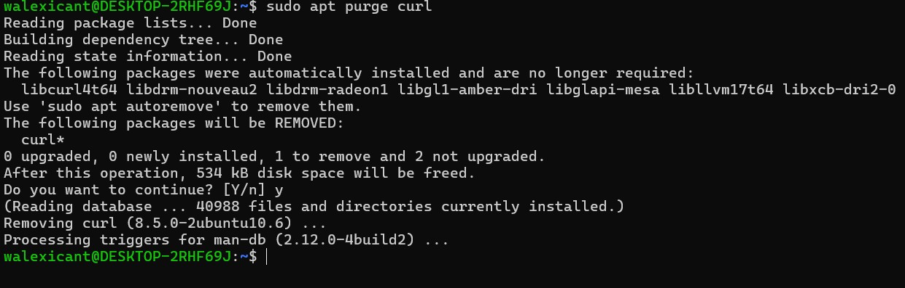

## 1. Make Directory

The script above creates a directory called Cli_lab

## 2. Create File
 
 The script above creates files Alpha, Beta,gamma,Delta, Epsilon in text format

## 3. Add Date

This adds date too all Text file in the cli_lab directory

## 4. Copy Alpha

The script above copies the alpha Text file to TMP folder

## 5. Move Beta

The script above Move Beta Text file to a newly created directory called Archive

## 6. Remove Epsilon

The script above Deletes the epsilon text file we earlier created

## 7. Copy ETC 

The script above Copies the service file from ETC to Cli_lab

## 8. Count Lines

This helps to count the line in the  Service TXT file

## 9. Non Comment 
 
 This print The Non-comment Lines.

## 10. Grep SSH

This searches for the string SSH in Text file

## 11.  Man Less
   
   The Above screenshot shows the function of the -R in the Less command

## 12. Dos 2 unix

The Above Screenshot shows how to convert DOS to Unix

## 13. Mkdir 

   The screenshot shows the description for parents directory 

## 14. Upgrade
   
   The above screenshots  helps update and upgrade existing packages

## 15. HTOP Install

This script Installs HTOP Package
  

## 16. Htop Version

The Script Shows The Version Of HTOP Installed

## 17. Htop Remove

The script remove Htop without deleting packages

## 18. Htop Reinstall

The script Re-installs Top
 

## 19. Htop Hold

The above screenshot stops HTOP from being updated when system packages are being updated

## 20. HtopShow

The above script shows all packages under hold

## 21. Display Package Information

The Above screenshot shows detailed information about CURL

## 22. Export Curl Dependencies

The Script export Curl Dependencies.

## 23. APT Remove VS Purge

The two screenshot shows the difference between Purge and remove. Purge deletes all related files and settings while remove keeps the settings.

## 24. Enable the universe repository

The Script enables the universal repository

## 25. Refresh Package

This Refresh existing packages.
       